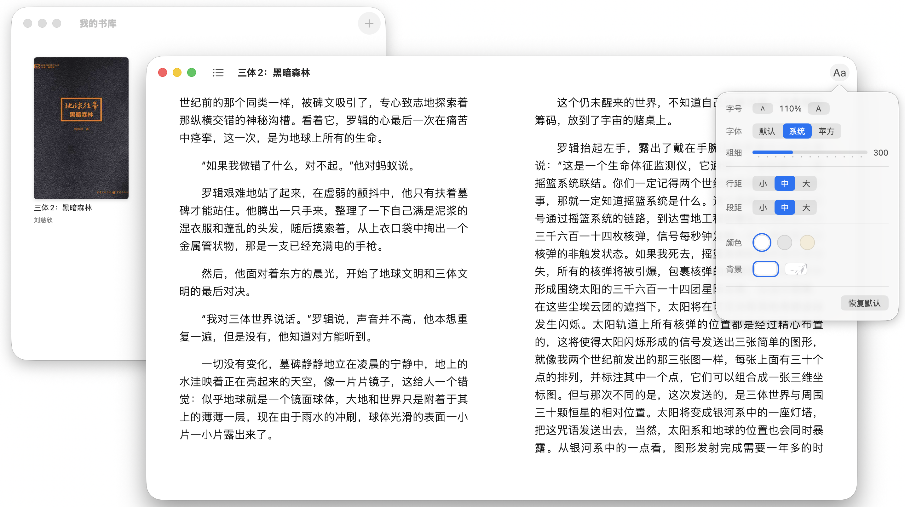

# MyReader

一个轻量的 macOS 原生中文阅读器，仅用 2500 行代码实现。 

## 功能

**书库**

- 导入电子书（EPUB 格式），开始阅读
- 管理、重命名、删除书籍

**阅读**

- `←` / `→` 翻页
- 单双栏视图自动切换
- 阅读进度自动保存

**样式**

- 选择字体、调节字号与字体粗细
- 调整行距、段距
- 切换背景色、背景图案

## 安装

1. 从 [Releases](https://github.com/qyangcv/MyReader/releases/latest) 下载最新的 `MyReader.dmg`
2. 打开 dmg，将 MyReader 拖入 “应用程序” 文件夹
3. 首次打开时会被系统拦截，前往 “系统设置 > 隐私与安全性”，点击“仍要打开”

> 应用未经 Apple 公证，因此需要手动放行，仅首次打开时需要。也可以在终端执行 `xattr -dr com.apple.quarantine /Applications/MyReader.app` 代替第 3 步。

## 技术栈

- [ZIPFoundation](https://github.com/weichsel/ZIPFoundation)
- [ReadiumCSS](https://github.com/readium/css)
