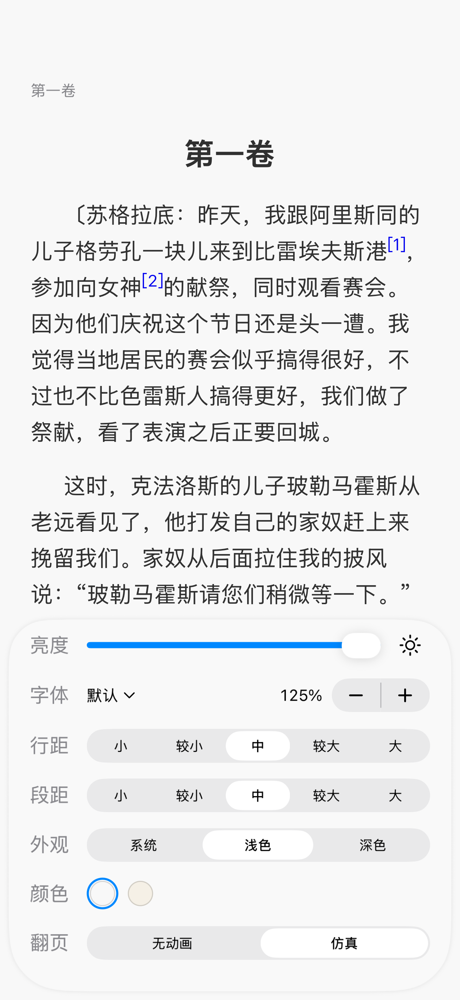
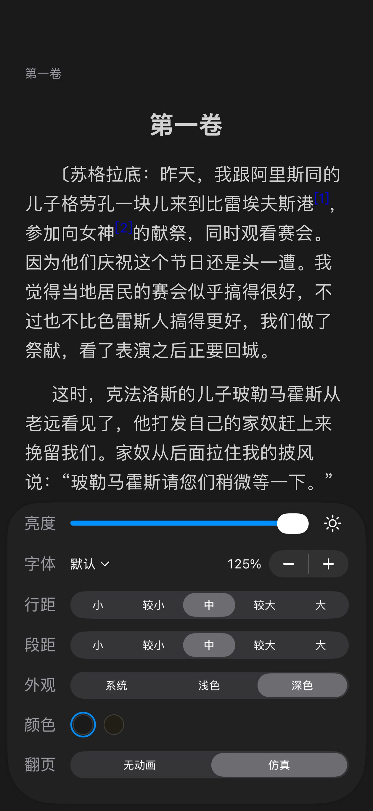

# Rede

一款开源、免费、原生的中文 EPUB 阅读器，支持 macOS 与 iOS，通过 iCloud 双端同步。

## 预览

### Rede for iOS

<table>
  <tr>
    <td align="center"> 样式面板</td>
    <td align="center"> 深色模式1</td>
  </tr>
</table>

### Rede for macOS

## 功能

- 书籍管理：导入和导出书籍、批量管理、查看元信息
- 阅读样式：调节字号与粗细、调节行距段距、切换深色模式/浅色模式
- 内容标注：书签、高亮、笔记
- iCloud 同步

## 安装

**macOS**

> 需要 macOS 版本 >= 26.0

1. 从 [Releases](https://github.com/qyangcv/Rede/releases/latest) 下载最新的 `Rede.dmg`
2. 打开 dmg，将 Rede 拖入 “应用程序” 文件夹

**iOS** 

> 需要 iOS 版本 >= 26.0

1. 在 App Store 安装 [TestFlight](https://apps.apple.com/app/testflight/id899247664)
2. 在 iOS 上打开 [TestFlight 链接](https://testflight.apple.com/join/UvDG6ykV)，安装 Rede 测试版

## 使用的开源工具

- [ZIPFoundation](https://github.com/weichsel/ZIPFoundation)
- [ReadiumCSS](https://github.com/readium/css)
- [Sparkle](https://github.com/sparkle-project/Sparkle)
- [Kanna](https://github.com/tid-kijyun/Kanna)
