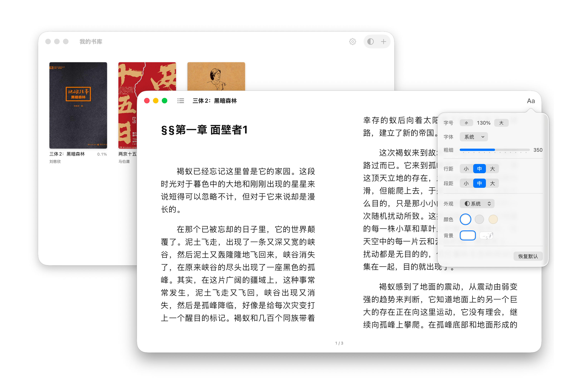
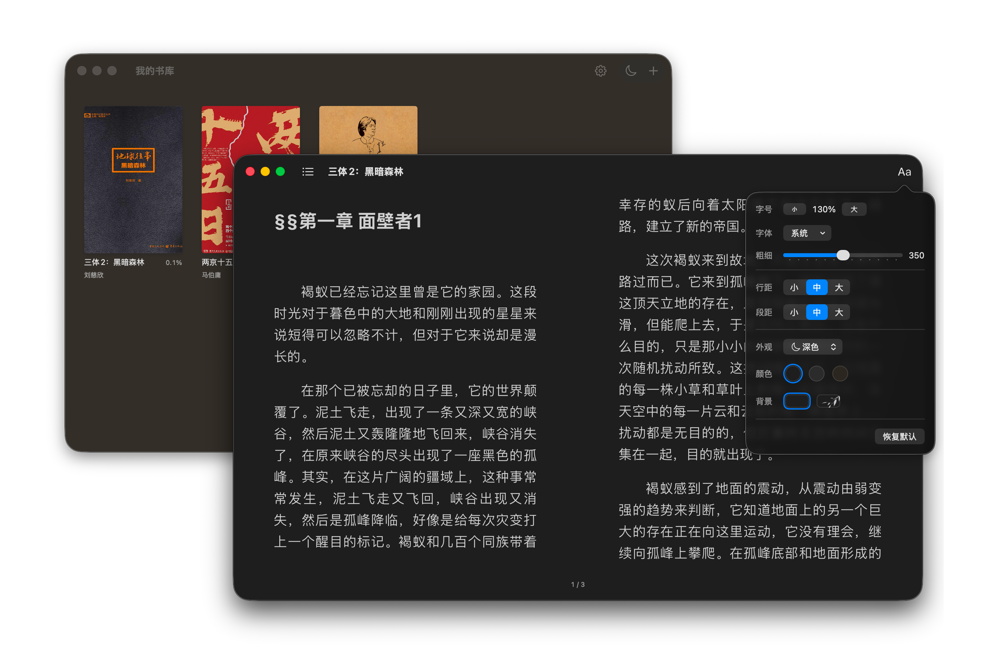

# Rede

一个轻量的 macOS 原生中文阅读器，仅 2 MB。 

## 预览

## 功能

**书库**

- 导入电子书（EPUB 格式），开始阅读
- 管理、重命名、删除书籍

**阅读**

- 方向键 `←` / `→` 翻页
- 单双栏视图自动切换
- 阅读进度自动保存

**样式**

- 选择字体、调节字号与字体粗细
- 调整行距、段距
- 切换深色模式、浅色模式
- 切换背景色、背景图案

**检查更新**

- 菜单栏 “Rede > 检查更新”

## 安装

1. 从 [Releases](https://github.com/qyangcv/Rede/releases/latest) 下载最新的 `Rede.dmg`
2. 打开 dmg，将 Rede 拖入 “应用程序” 文件夹

## 使用的开源工具

- [ZIPFoundation](https://github.com/weichsel/ZIPFoundation)
- [ReadiumCSS](https://github.com/readium/css)
- [Sparkle](https://github.com/sparkle-project/Sparkle)
- [Kanna](https://github.com/tid-kijyun/Kanna)

## 后续开发方向

- Rede for iOS，双端 iCloud 云同步